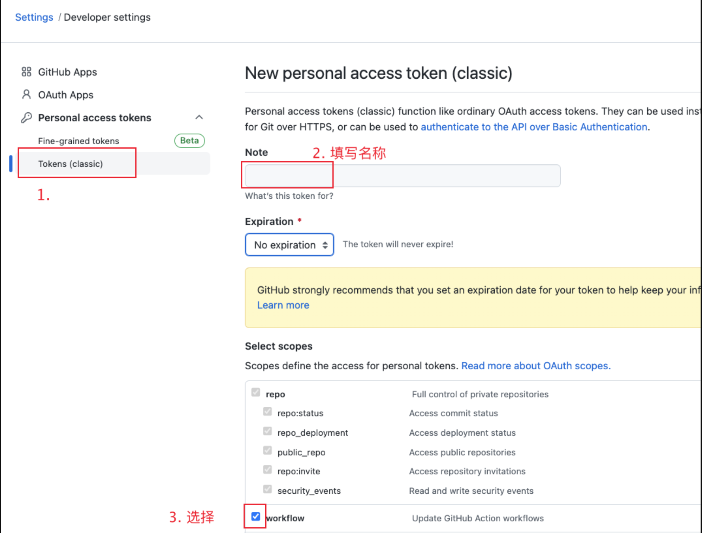
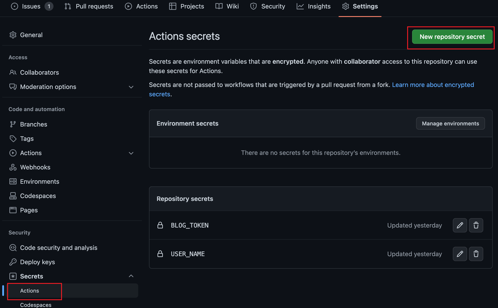
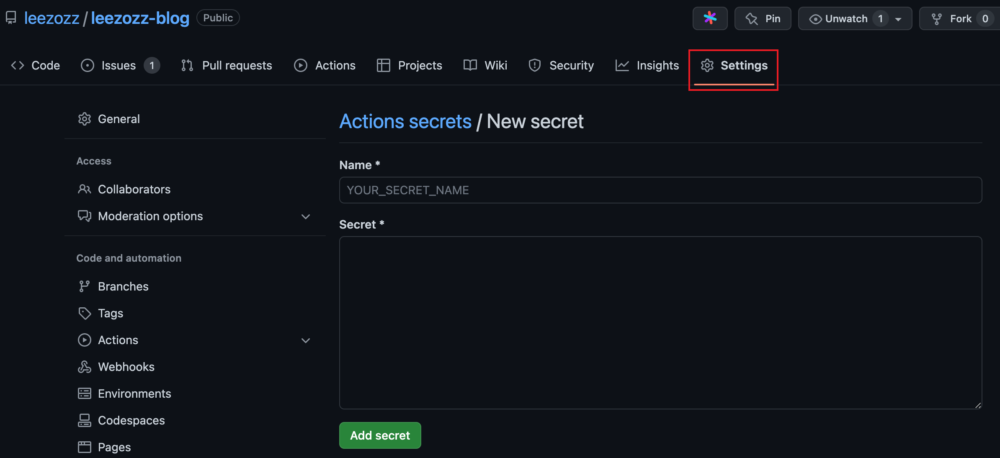
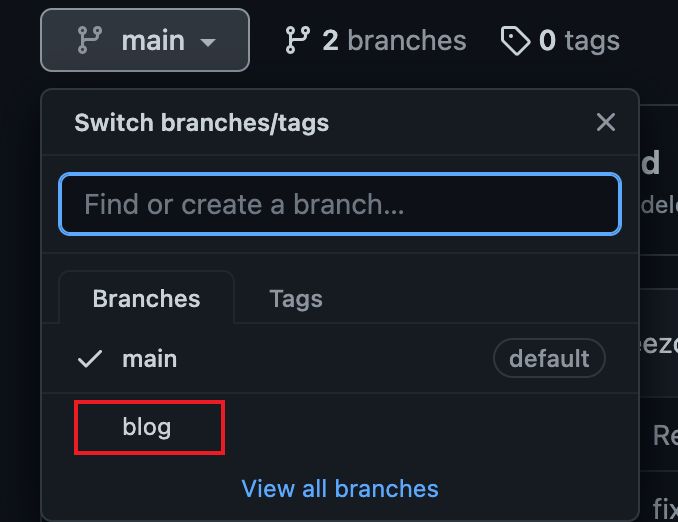
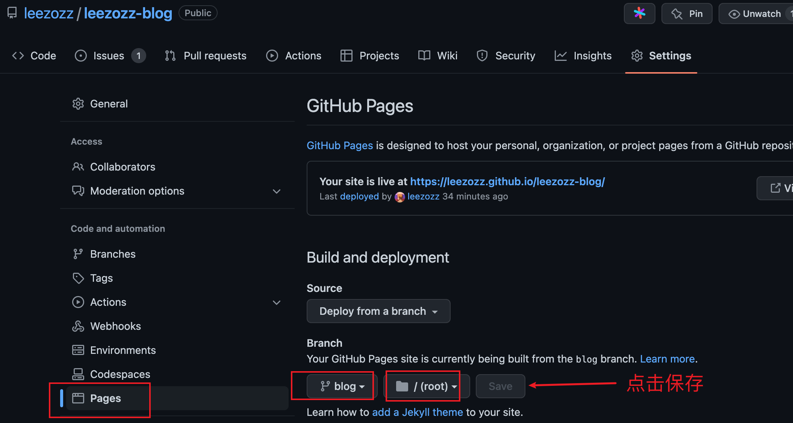
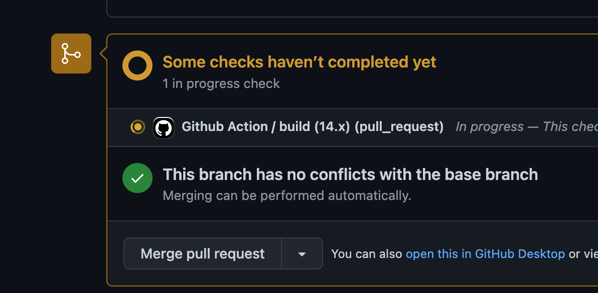
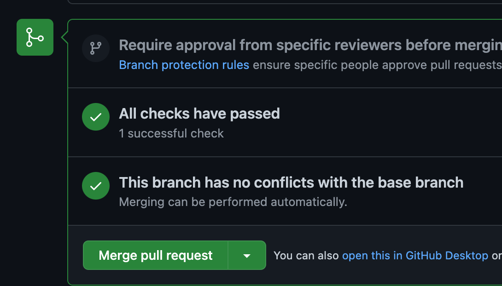
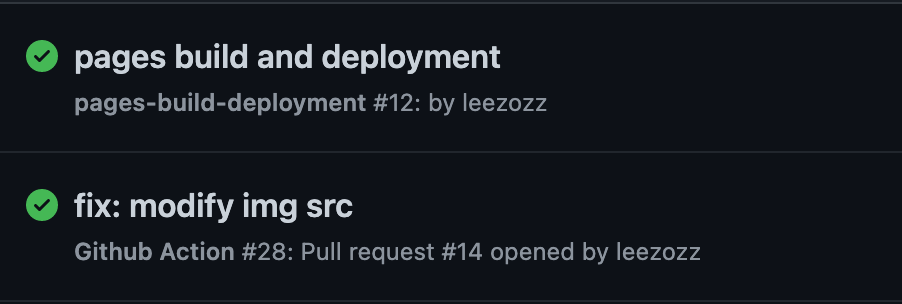
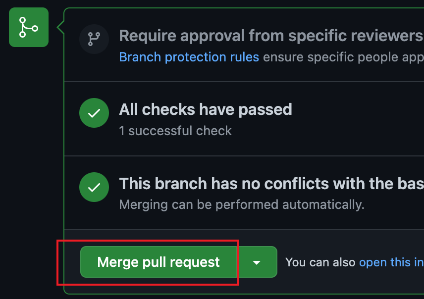

## github自动部署
### 基本概念：GitHub Action
GitHub Actions 是一个**持续集成**和**持续交付**的平台，它可以做到自动化构建、测试、部署。你可以创建工作流，构建和测试每一个 pull request 或者部署合并后的代码到生产环境。

::: tip
持续集成的目的，就是让产品可以快速迭代，同时还能保持高质量。它的核心措施是，代码集成到主干之前，必须通过自动化测试。只要有一个测试用例失败，就不能集成。
:::

- （1）workflow （工作流程）：持续集成一次运行的过程，就是一个 workflow。
- （2）job （任务）：一个 workflow 由一个或多个 jobs 构成，含义是一次持续集成的运行，可以完成多个任务。
- （3）step（步骤）：每个 job 由多个 step 构成，一步步完成。
- （4）action （动作）：每个 step 可以依次执行一个或多个命令（action）。

### 步骤：
- 1. 根目录下新建一个目录.github/workflows，里面新建一个yml文件，文件名称随意。下面是相关配置内容（工作流）：
```yml
name: Github Action

on: # 监听pull_request
  pull_request:
   branches:
    - main

jobs: # 任务
  build: # 自定义名称
    runs-on: ubuntu-latest

    strategy:
      matrix:
        node-version: [14.x]
    steps:  # 指定每个job的运行步骤。可以包含一个或多个步骤
      - name: Checkout  # 步骤1
        uses: actions/checkout@v1 # 作用：获取源码。 官方actions库：https://github.com/actions

      - name: Use Node.js ${{ matrix.node-version }} # 步骤2
        uses: actions/setup-node@v1 # 作用：安装nodejs
        with:
          node-version: ${{ matrix.node-version }} # 版本

      - name: Build and Deploy # 步骤3
        # 构建和部署
        run: |  # %ae 作者的电子邮件地址 【git log --pretty=format:  格式化log输出】
          echo '获取仓库基本信息'
          remote_addr=`git remote get-url --push origin`
          commit_info=`git describe --all --always --long`
          user_name='leezozz'
          user_email=`git log -1 --pretty=format:'%ae'`   
          deploy_branch=blog  

          echo ${remote_addr}
          echo ${commit_info}
          echo ${deploy_branch}

          yarn
          yarn build
          cd public
          git config --global init.defaultBranch $deploy_branch
          git init
          echo ${user_name}
          echo ${user_email}

          git config user.name ${user_name}
          git config user.email ${user_email}
          echo '设置git用户信息完成'

          git add -A
          git commit -m "auto deploy, $commit_info"
          remote_addr=`echo $remote_addr | awk -F'://' '{print $2}'`
          remote_addr=https://${user_name}:${{secrets.BLOG_TOKEN}}@${remote_addr}
          echo ${remote_addr}
          git remote add origin ${remote_addr}
          git push origin HEAD:$deploy_branch --force # 推送到github $deploy_branch分支
```
- 2. 在个人GitHub页面，依次点击Settings->Developer settings->Personal access tokens
- 3. 点击Generate new token出现如下界面，在Note中输入名称，在Select scopes选择workflow
<!-- ! + [图片描述 ] + (图片的url 【可以是网络地址、本地地址】) -->
<!--  -->



- 4. 将生成的token复制出来为后续创建secret做准备，注意必须及时复制，一旦离开此页面后续就无法查看其值，只能重新创建新token

- 5. 进入对应的GitHub项目下，依次点击Settings->Secrets->Actions进入添加Action secrets的界面，点击New repository secret按钮。


- 6. 在出现的界面中name部分输入我们设置的值，Secret部分输入步骤4中记录的token值，然后点击Add secret按钮
需要注意的是name的值不能以GITHUB_开头，否则创建会出错


- 7. 此时token值设置完毕，可以直接在yml文件中使用 `secrets.BLOG_TOKEN `

- 8. 把打包后的文件推送新的分支，例如blog分支
  

- 9. 设置github网址，点击保存，会在上方生成相应网址：[https://leezozz.github.io/leezozz-blog/](https://leezozz.github.io/leezozz-blog/) <br />
  
此时，每新建一个pr请求就会自动触发actions，开始执行yml文件的命令，自动进行打包更新操作

- 10. 注意 <br />
**Github flow 是 Github.com 使用的工作流程**
::: tip
而github flow模型保证高质量的核心措施是：在集成前通过pull request，从而触发审核（审核可以是一系列的自动化校验测试以及代码审核Code Review），在审核通过后再合并到主干，从而保证主干的稳定性。
:::
（1）新建合并请求
 
（2）自动审核通过
  
（3）点击acitons，查看/等待审核通过
  
（4）此时，点击合并请求
  
（5）此时[https://leezozz.github.io/leezozz-blog/](https://leezozz.github.io/leezozz-blog/) 已经自动更新了