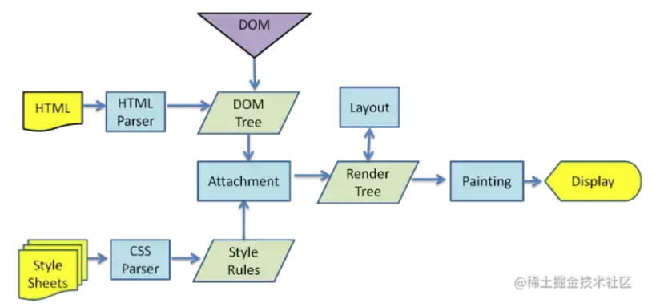

### 何为虚拟DOM
Virtual dom, 即虚拟DOM节点。它通过JS的Object对象模拟DOM中的节点，然后再通过特定的render方法将其渲染成真实的DOM节点。

### webkit 渲染引擎工作流程图
所有的浏览器渲染引擎工作流程大致分为5步：创建 DOM 树 —> 创建 Style Rules -> 构建 Render 树 —> 布局 Layout -—> 绘制 Painting

- 第一步，构建 DOM 树：用 HTML 分析器，分析 HTML 元素，构建一棵 DOM 树；
- 第二步，生成样式表：用 CSS 分析器，分析 CSS 文件和元素上的 inline 样式，生成页面的样式表；
- 第三步，构建 Render 树：将 DOM 树和样式表关联起来，构建一棵 Render 树（Attachment）。每个 DOM 节点都有 attach 方法，接受样式信息，返回一个 render 对象（又名 renderer），这些 render 对象最终会被构建成一棵 Render 树；
- 第四步，确定节点坐标：根据 Render 树结构，为每个 Render 树上的节点确定一个在显示屏上出现的精确坐标；
- 第五步，绘制页面：根据 Render 树和节点显示坐标，然后调用每个节点的 paint 方法，将它们绘制出来。

**注意：**
1. DOM 树的构建是文档加载完成开始的？ 构建 DOM 树是一个渐进过程，为达到更好的用户体验，渲染引擎会尽快将内容显示在屏幕上，它不必等到整个 HTML 文档解析完成之后才开始构建 render 树和布局。
2. Render 树是 DOM 树和 CSS 样式表构建完毕后才开始构建的？ 这三个过程在实际进行的时候并不是完全独立的，而是会有交叉，会一边加载，一边解析，以及一边渲染。
3. CSS 的解析注意点？ CSS 的解析是从右往左逆向解析的，嵌套标签越多，解析越慢。
4. JS 操作真实 DOM 的代价？ 用我们传统的开发模式，原生 JS 或 JQ 操作 DOM 时，浏览器会从构建 DOM 树开始从头到尾执行一遍流程。在一次操作中，我需要更新 10 个 DOM 节点，浏览器收到第一个 DOM 请求后并不知道还有 9 次更新操作，因此会马上执行流程，最终执行10 次。例如，第一次计算完，紧接着下一个 DOM 更新请求，这个节点的坐标值就变了，前一次计算为无用功。计算 DOM 节点坐标值等都是白白浪费的性能。即使计算机硬件一直在迭代更新，操作 DOM 的代价仍旧是昂贵的，频繁操作还是会出现页面卡顿，影响用户体验

### 虚拟 DOM 的好处
虚拟 DOM 就是为了解决浏览器性能问题而被设计出来的。如前，若一次操作中有 10 次更新 DOM 的动作，虚拟 DOM 不会立即操作 DOM，而是将这 10 次更新的 diff 内容保存到本地一个 JS 对象中，最终将这个 JS 对象一次性 attch 到 DOM 树上，再进行后续操作，避免大量无谓的计算量。所以，用 JS 对象模拟 DOM 节点的好处是，页面的更新可以先全部反映在 JS 对象(虚拟 DOM )上，操作内存中的 JS 对象的速度显然要更快，等更新完成后，再将最终的 JS 对象映射成真实的 DOM，交由浏览器去绘制。

[参考-掘金](https://juejin.cn/post/6844903895467032589)
