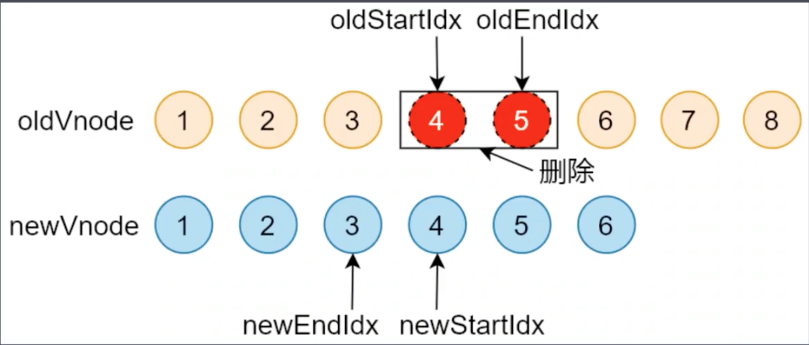

## 什么是 Diff 算法
diff 算法就是用来计算出 Virtual Dom 中被改变的部分。因为Vue React 框架都是 只用改变状态类影响视图自动更新，因此当数据状发生变化时候要计算出 对应的最小的变化的部分，而不是重新渲染政整个页面，以此达到节约性能的目的。

**梳理一下整个DOM-diff的过程：**
- 用JS对象模拟DOM（虚拟DOM）
- 把此虚拟DOM转成真实DOM并插入页面中（render）
- 如果有事件发生修改了虚拟DOM，比较两棵虚拟DOM树的差异，得到差异对象（diff）
- 把差异对象应用到真正的DOM树上（patch）

## 虚拟DOM
diff 算法就是用来计算出 Virtual Dom 中被改变的部分。因为Vue React 框架都是 只用改变状态类影响视图自动更新，因此当数据状发生变化时候要计算出 对应的最小的变化的部分，而不是重新渲染政整个页面，以此达到节约性能的目的。<br />

## updateChildren整体过程
### diff算法类似排序算法：
- 查找两棵树每一个节点的差异。（第一棵树的每个节点去和第二棵树的每一个节点去对比，若有n个节点，比较n²次。找到差异，在进行一次循环，更新差异的部分。）<br />

### Snabbdom根据DOM的特点对传统的diff算法做了优化
- DOM操作时候很少会跨级别操作节点
- 只比较同级别的节点（若有n个节点，则比较n次）

### 执行过程
对开始和结束节点比较的时候，总共有四种情况：
- oldStartVnode/newStartVnode（旧开始节点/新开始节点）
- oldEndVnode/newEndVnode（旧结束节点/新结束节点）
- oldStartVnode/newEndVnode（旧开始节点/新结束节点）
- oldEndVnode/newStartVnode（旧结束节点/新开始节点）


#### 开始节点和结束节点
如果新旧开始节点是sameVnode（key和sel相同）
- 调用patchVnode()对比和更新节点
- 把旧开始和新开始索引往后移动 oldStartIdx++ / newStartIdx++

如果新旧开始节点不是sameVnode，就从最后一个节点开始比较，如果最后一个节点是sameVnode，移动索引，开始比较倒数第二个节点
:::tip
如果是sameVnode，复用旧节点对应的DOM元素。在patchVnode中会对比新旧vnode的差异，把变化的部分更新到复用的旧节点元素上。如果是文本、子元素发生变化，不需要创建DOM，不会进行DOM操作，以此来提高性能。
:::

#### 旧开始节点和新结束节点
- 调用patchVnode()对比和更新节点
- 把oldStartVnode对应的DOM元素，移动到右边，更新索引


#### 旧结束节点和新开始节点
- 调用patchVnode()对比和更新节点
- 把oldStartVnode对应的DOM元素，移动到左边，更新索引


### 循环结束
- 当老节点的所有子节点先遍历完（oldStartIdx > oldEndIdx），循环结束
- 新节点的所有子节点先遍历完（newStartIdx > newEndIdx），循环结束

**oldStartIdx > oldEndIdx**
- 如果老节点的数组先遍历完（oldStartIdx > oldEndIdx）
- 说明新节点有剩余，把剩余节点批量插入到右边


**newStartIdx > newEndIdx**
- 如果新节点的数组先遍历完（newStartIdx > newEndIdx）
- 说明老节点有剩余，把剩余节点批量删除


## 总结
- 使用 Virtual DOM，在首次渲染的时候会影响性能因为要创建额外的对象来描述真实 DOM，在更新少量标签的时候也不会有性能上的提升，在 DOM 结构复杂的时候更新 DOM，会有性能的提升，因为仅仅会把前后两次 DOM 树的差异，更新到真实 DOM。
- VNode 的 key 属性是可选的，当需要的时候给它赋值
- 给 VNode 设置 key 之后，当在对元素列表排序，或者给列表项插入项的时候会重用上一次对应的 DOM 对象，减少渲染次数，因此会提高性能
- Snabbdom 中的 patch 函数是通过 Snabbdom 的入口函数 init 生成的，init 中初始化模块和 DOM 操作的 api，最终返回 patch，这里的 init 是一个高阶函数，在 init 函数内部缓存了两个参数，在返回的 patch 函数中可以通过闭包访问到 init 中初始化的模块和 DOM 操作的 api
- patch 函数接收新旧两个 VNode 作为参数，其中第一个参数即可以是 DOM 对象又可以是 VNode 对象，如果第一个参数是 DOM 对象的话，patch 内部会先把 DOM 对象转换成 VNode，再和第二个参数中的新的 VNode 对比，然后更新 DOM
- patchVnode 的作用是对比新旧两个 VNode 节点本身，如果两个节点都没有 text 属性再去对比他们的子节点，如果有 text 属性并且新旧 VNode 的 text 不相等，这时候把新节点的 text 属性更新到 DOM 上
- updateChildren 函数的作用是对比新旧 VNode 节点的子节点，在对比的过程中因为 DOM 操作的特殊性，同时也为了优化操作，所以只对比两颗树中的同一层级的子节点。
- createElm 函数的作用是把 VNode 转换成 DOM 对象，但是没有把新创建的 DOM 挂载到 DOM 树，而是先存储到当前 VNode 对象的 elm 属性中，并返回新创建的 DOM 对象

<!-- vue虚拟DOM -->
<!-- 页面中元素如下：
```html
<div id="app">
  <p class="text">hello world!!!</p>
</div>
```

转换为虚拟DOM以后就是这样：
```js
{
  tag: 'div',
  props: {
    id: 'app'
  },
  chidren: [
    {
      tag: 'p',
      props: {
        className: 'text'
      },
      chidren: [],
      text: 'hello world!!!'
    }
  ]
}
``` -->

