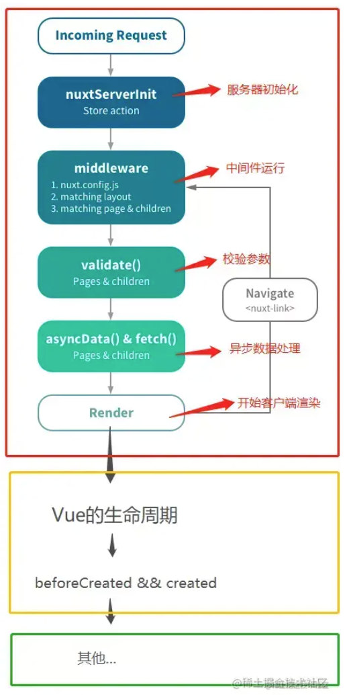

### 生命周期
 

简单来说，Nuxt就是基于Vue的一个应用框架，采用**服务端渲染**，让你的SPA应用（Vue）也可以拥有**SEO**<br />
Nuxt.js简单的说是Vue.js的通用框架，最常用的就是用来作**SSR（服务器端渲染）**。再直白点说，就是Vue.js原来是开发SPA（单页应用）的，但是随着技术的普及，很多人想用Vue开发多页应用，并在服务端完成渲染。这时候就出现了Nuxt.js这个框架，她简化了SSR的开发难度。还可以直接用命令把我们制作的vue项目生成为静态html。<br />
Vue的生命周期全都跑在客户端(浏览器)，而Nuxt的生命周期有些在服务端(Node)、客户端，甚至两边都在，绿框内运行在客户端。<br />
**因为红框、黄框内的周期都不存在Window对象，所以不能直接使用window，会报错**<br />
<br />
下面详细讲一下每个钩子函数执行情况：<br />
1. incoming request
这个阶段是服务器收到请求，开始走流程
2. nuxtServerInit
- 服务器初始化
- 只能够在store/index.js中使用
- 用于在渲染页面之前存储数据到vuex中
3. middleware
这个阶段会执行一些预定义的中间件，自己定义的中间件也会在这个阶段执行
4. validate
可以让你在动态路由对应的页面组件中配置一个校验方法用于校验动态路由参数的有效性。(具体实现请参考官方文档)
5. asyncData
这个方法可以使得你能够在渲染组件之前异步获取数据。好比你在vue组件中用created获取数据一样，不同的是asyncData是在服务端执行的<br />
还有要注意的是：asyncData只是在首屏的时候调用一次（即页面渲染之前，所以事件触发不了它）
6. fetch
fetch 方法用于在渲染页面前填充应用的状态树（store）数据， 与 asyncData 方法类似，不同的是它不会设置组件的数据。<br />
如果页面组件设置了 fetch 方法，它会在组件每次加载前被调用（在服务端或切换至目标路由之前）。<br />
fetch 方法的第一个参数是页面组件的上下文对象 context，我们可以用 fetch 方法来获取数据填充应用的状态树。为了让获取过程可以异步，你需要返回一个 Promise，Nuxt.js 会等这个 promise 完成后再渲染组件。<br />
注意，在fetch阶段可以使用this获取组件实例，fetch是在组件初始化之前被调用（好像fetch函数也会在created和beforeMount之间执行一次）<br />
如果要在fetch中调用并操作store，请使用store.dispatch，但是要确保在内部使用async / await等待操作结束：
```js
async fetch({ store, params }) {
  await store.dispatch('GET_STARS')
}
```
7. render
这个阶段开始准备客户端渲染，如果过程中有通过nuxt-link跳转，会退回至middleware阶段重新执行
8. beforeCreat和created阶段
这个和vue中的钩子函数功能基本类似，有一个小的差别，vue的这两个钩子只在客户端执行，nuxt的这两个钩子在客户端和服务端都会执行一遍
9. 其他阶段
之后的阶段都是在客户端中执行，比如beforeMount和mounted阶段等等 <br />
参考：https://juejin.cn/post/7018474081758478350

### SEO
SEO（搜索引擎优化）是一种让网站在搜索引擎结果中更加清晰，也帮助我们将搜索结果更靠前


