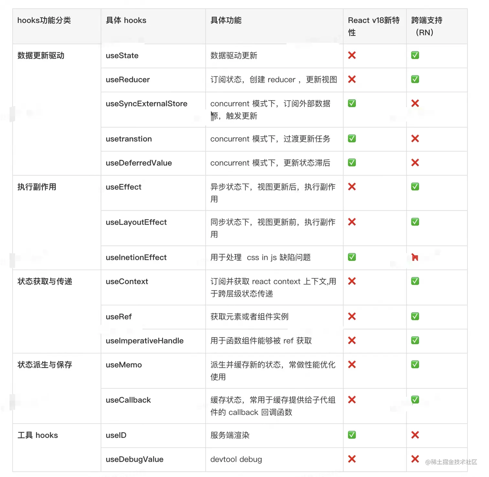

React hooks是react16.8以后，新增的钩子API，目的是增强代码的可复用性、逻辑性、弥补无状态组件没有生命周期，没有数据管理状态state的缺陷。<br />
参考：https://juejin.cn/post/7118937685653192735?searchId=202307181556150668100E316845A2818C

## 1.技术背景
### 1.1 react hooks解决了什么问题？

Hooks出现的本质原因是：
- 让函数组件也能做类组件的事，有自己的状态，可以处理一些副作用，能获取 ref ，也能做数据缓存。
- 解决逻辑复用难的问题。
- 放弃面向对象编程，拥抱函数式编程。

### 1.2 功能概览 
按照功能分为：数据更新驱动，状态获取与传递，执行副作用，状态派生与保存，和工具类型。


## 2.hook之数据更新驱动
### 2.1 useState可以使函数组件像类组件一样拥有state，函数组件通过useState可以让组件重新渲染，更新视图。
```js
const [ ①state , ②dispatch ] = useState(③initData)
```
① state，目的提供给UI，作为渲染视图的数据源 <br />
② dispatchAction改变state的函数，可以理解为推动函数组件渲染的渲染函数 <br />
③ initData有两种情况，第一种情况是非函数，将作为state初始化的值。第二种情况是函数，函数的返回值作为useState初始化的值<br/>
**useState基础用法：**
```js
const DemoState = (props) => {
  /* number为此时state读取值 ，setNumber为派发更新的函数 */
   let [number, setNumber] = useState(0) /* 0为初始值 */
   return (<div>
       <span>{ number }</span>
       <button onClick={ ()=> {
         setNumber(number+1)
         console.log(number) /* 这里的number是不能够即使改变的  */
       } } ></button>
   </div>)
}
```
**注意事项：**
1. 如果两次 dispatchAction 传入相同的 state 值，那么组件就不会更新
```js
export default function Index(){
  const [ state  , dispatchState ] = useState({ name:'alien' })
  const  handleClick = ()=>{ // 点击按钮，视图没有更新。
    state.name = 'Alien'
    dispatchState(state) // 直接改变 `state`，在内存中指向的地址相同。
  }
  return <div>
    <span> { state.name }</span>
    <button onClick={ handleClick }  >changeName++</button>
  </div>
}
```
### 2.2 useReducer
useReducer 是 react-hooks 提供的能够在无状态组件中运行的类似redux的功能 api<br />
useReducer 基础介绍：
```js
const [ ①state , ②dispatch ] = useReducer(③reducer)
```
① 更新之后的 state 值。<br />
② 派发更新的 dispatchAction 函数, 本质上和 useState 的 dispatchAction 是一样的。<br />
③ 一个函数 reducer ，我们可以认为它就是一个 redux 中的 reducer , reducer的参数就是常规reducer里面的state和action, 返回改变后的state, 这里有一个需要注意的点就是：如果返回的 state 和之前的 state ，内存指向相同，那么组件将不会更新。<br />
**useReducer基础用法：**
```js
const DemoUseReducer = ()=>{
    /* number为更新后的state值,  dispatchNumbner 为当前的派发函数 */
   const [ number , dispatchNumbner ] = useReducer((state,action)=>{
      const { payload , name  } = action
      /* return的值为新的state */
      switch(name){
          case 'add':
              return state + 1
          case 'sub':
              return state - 1 
          case 'reset':
            return payload       
      }
      return state
   },0)
   return <div>
     当前值：{ number }
     { /* 派发更新 */ }
     <button onClick={()=>dispatchNumbner({ name:'add' })} >增加</button>
     <button onClick={()=>dispatchNumbner({ name:'sub' })} >减少</button>
     <button onClick={()=>dispatchNumbner({ name:'reset' ,payload:666 })} >赋值</button>
        { /* 把dispatch 和 state 传递给子组件  */ }
     <MyChildren  dispatch={ dispatchNumbner } State={{ number }} />
   </div>
}
```
[reducer函数](https://zh-hans.react.dev/learn/extracting-state-logic-into-a-reducer)：对于拥有许多状态更新逻辑的组件来说，过分分散的事件处理程序可能会令人不知所措。对于这种情况，你可以将组件的所有状态更新逻辑整合到一个外部函数中，这个函数叫做reducer。

## 3.hooks之执行副作用
### 3.1 useEffect
```js
useEffect(()=>{
    return destory
},dep)
```
useEffect第一个参数callback，返回的destory，destory作为下一次callback执行之前调用，用于清除上一次callback产生的副作用。<br />
第二个参数作为依赖项，是一个数组，可以有多个依赖项，依赖项改变，执行上一次callback 返回的 destory ，和执行新的 effect 第一个参数 callback 。<br />
对于 useEffect 执行， React 处理逻辑是采用异步调用 ，对于每一个 effect 的 callback， React 会向 setTimeout回调函数一样，放入任务队列，等到主线程任务完成，DOM 更新，js 执行完成，视图绘制完毕，才执行。所以 effect 回调函数不会阻塞浏览器绘制视图。<br />
**useEffect基础用法：**
```js
/* 模拟数据交互 */
function getUserInfo(a){
  return new Promise((resolve)=>{
    setTimeout(()=>{ 
      resolve({
        name:a,
        age:16,
      }) 
    },500)
  })
}

const Demo = ({ a }) => {
  const [ userMessage , setUserMessage ]: any= useState({})
  const div= useRef()
  const [number, setNumber] = useState(0)
  /* 模拟事件监听处理函数 */
  const handleResize =()=>{}
  /* useEffect使用 ，这里如果不加限制 ，会是函数重复执行，陷入死循环*/
  useEffect(()=>{
     /* 请求数据 */
     getUserInfo(a).then(res=>{
      setUserMessage(res)
     })
     /* 定时器 延时器等 */
     const timer = setInterval(()=>console.log(666), 1000)
     /* 操作dom  */
     console.log(div.current) /* div */
     /* 事件监听等 */
     window.addEventListener('resize', handleResize)
       /* 此函数用于清除副作用 */
     return function(){
      clearInterval(timer) 
      window.removeEventListener('resize', handleResize)
     }
  /* 只有当props->a和state->number改变的时候 ,useEffect副作用函数重新执行 ，如果此时数组为空[]，证函数只有在初始化的时候执行一次相当于componentDidMount */
  },[ a, number ])
  return (<div ref={div} >
    <span>{ userMessage.name }</span>
    <span>{ userMessage.age }</span>
    <div onClick={ ()=> setNumber(1) } >{ number }</div>
  </div>)
}
```
如上在 useEffect 中做的功能如下：<br />
① 请求数据。<br />
② 设置定时器,延时器等。<br />
③ 操作 dom , 在 React Native 中可以通过 ref 获取元素位置信息等内容。<br />
④ 注册事件监听器, 事件绑定，在 React Native 中可以注册 NativeEventEmitter 。<br />
⑤ 还可以清除定时器，延时器，解绑事件监听器等。

## 4.hooks 之状态派生与保存
### 4.1 useMemo
useMemo可以在函数组件render上下文中同步执行一个函数逻辑，这个函数的返回值可以作为一个新的状态缓存起来。那么这个hooks的作用就显而易见了：
- 场景一：在一些场景下，需要在函数组件中进行大量的逻辑计算，那么我们不期望每一次函数组件渲染都执行这些复杂的计算逻辑，所以就需要在useMemo的回调函数中执行这些逻辑，然后把得到的产物（计算结果）缓存起来就可以了。
- 场景二：React 在整个更新流程中，diff 起到了决定性的作用，比如 Context 中的 provider 通过 diff value 来判断是否更新。<br />
**useMemo基础介绍：**
```js
const cacheSomething = useMemo(create,deps)
```
① create：第一个参数为一个函数，函数的返回值作为缓存值，如上 demo 中把 Children 对应的 element 对象，缓存起来。<br />
② deps： 第二个参数为一个数组，存放当前 useMemo 的依赖项，在函数组件下一次执行的时候，会对比 deps 依赖项里面的状态，是否有改变，如果有改变重新执行 create ，得到新的缓存值。<br />
③ cacheSomething：返回值，执行 create 的返回值。如果 deps 中有依赖项改变，返回的重新执行 create 产生的值，否则取上一次缓存值。<br />
**useMemo基础用法：**<br />
派生新状态：
```js
function Scope() {
  const keeper = useKeep()
  const { cacheDispatch, cacheList, hasAliveStatus } = keeper
  /* 通过 useMemo 得到派生出来的新状态 contextValue  */
  const contextValue = useMemo(() => {
    return {
      cacheDispatch: cacheDispatch.bind(keeper),
      hasAliveStatus: hasAliveStatus.bind(keeper),
      cacheDestory: (payload) => cacheDispatch.call(keeper, { type: ACTION_DESTORY, payload })
    }
  }, [keeper])
  return <KeepaliveContext.Provider value={contextValue}>
  </KeepaliveContext.Provider>
}
```
如上通过 useMemo 得到派生出来的新状态 contextValue ，只有 keeper 变化的时候，才改变 Provider 的 value。<br />
缓存计算结果：<br />
```js
function Scope(){
  const style = useMemo(()=>{
    let computedStyle = {}
    // 经过大量的计算
    return computedStyle
  },[])
  return <div style={style} ></div>
}
```
缓存组件,减少子组件 rerender 次数：
```js
function Scope ({ children }){
  const renderChild = useMemo(()=>{ children()  },[ children ])
  return <div>{ renderChild } </div>
}
```
### 4.2 useCallback
useMemo 和 useCallback 接收的参数都是一样，都是在其依赖项发生变化后才执行，都是返回缓存的值，区别在于 useMemo 返回的是函数运行的结果，useCallback 返回的是函数，这个回调函数是经过处理后的也就是说父组件传递一个函数给子组件的时候，由于是无状态组件每一次都会重新生成新的 props 函数，这样就使得每一次传递给子组件的函数都发生了变化，这时候就会触发子组件的更新，这些更新是没有必要的，此时我们就可以通过 usecallback 来处理此函数，然后作为 props 传递给子组件。<br />
**useCallback基础用法：**
```js
/* 用react.memo */
const DemoChildren = React.memo((props)=>{
  /* 只有初始化的时候打印了 子组件更新 */
  console.log('子组件更新')
  useEffect(()=>{
    props.getInfo('子组件')
  },[])
  return <div>子组件</div>
})

const DemoUseCallback=({ id })=>{
  const [number, setNumber] = useState(1)
  /* 此时usecallback的第一参数 (sonName)=>{ console.log(sonName) }
   经过处理赋值给 getInfo */
  const getInfo  = useCallback((sonName)=>{
    console.log(sonName)
  },[id])
  return <div>
    {/* 点击按钮触发父组件更新 ，但是子组件没有更新 */}
    <button onClick={ ()=>setNumber(number+1) } >增加</button>
    <DemoChildren getInfo={getInfo} />
  </div>
}
```


