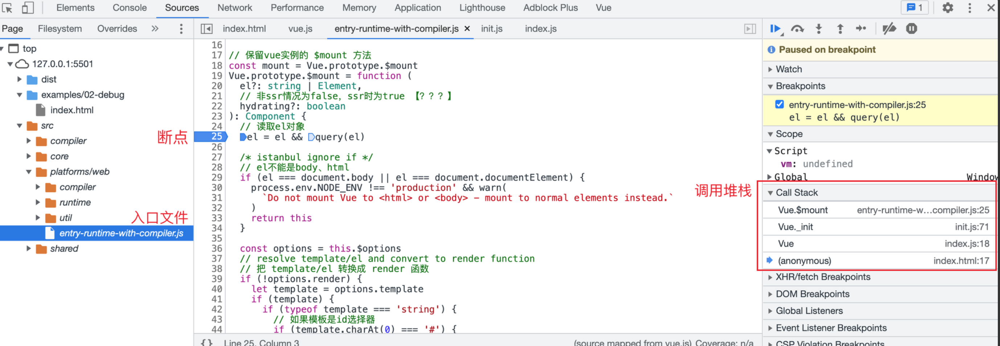

:::tip
这里使用vuejs2.6.0版本
:::

## 要点：
- 完整版：同时包含编译器和运行时版本
- 编译器：用来将模板字符串编译成为JavaScript渲染函数的代码，体积大、效率低（把模板转换成js渲染函数也就是render函数，render函数作用是生成虚拟DOM）（编译器约3000行左右）
- 运行时：用来创建vue实例、渲染并处理虚拟DOM等的代码，体积小、效率高。基本上就是除去编译器的代码
- UMD：UMD 版本通用的模块版本，支持多种模块方式（可以在浏览器直接使用）。 vue.js 默认文件就是运行时 + 编译器的UMD 版本
- CommonJS(cjs)：CommonJS 版本用来配合老的打包工具比如 Browserify 或 webpack 1。
- ES Module：从 2.6 开始 Vue 会提供两个 ES Modules (ESM) 构建文件，为现代打包工具提供的版本。（ESM 格式被设计为可以被静态分析，所以打包工具可以利用这一点来进行“tree-shaking”并将用不到的代码排除出最终的包。）
- 推荐使用运行时版本，因为运行时版本相比完整版体积要小大约 30%
- 基于 Vue-CLI 创建的项目默认使用的是 vue.runtime.esm.js<br />
导出 webpack 配置信息(导入到项目目录中)，output.js 可修改成自定义文件名
```js
// 使用vue-cli生成的项目默认使用esm版本vue，vue-cli对webpack进行了深度封装，在项目中找不到webpack的配置文件。使用如下命令可以查看
// 把配置文件输出到output文件中
vue inspect > output.js

// 下面是输出的配置文件
...
resolve: {
  alias: {
    '@': 'D:\\work\\03xxxxxxx',
    vue$: 'vue/dist/vue.runtime.esm.js'  // $：wepack的语法：精确匹配的意思
  }
}
...
```
**注意：** .vue 文件中的模板是在构建时预编译的，最终打包后的结果不需要编译器，只需要运行时版本即可


## 问题：
观察下面代码，通过阅读源码，回答在页面上输出的结果
```js
const vm = new Vue({ 
  el: '#app', 
  template: '<h3>Hello template</h3>', 
  render (h) { 
    return h('h4', 'Hello render') 
  } 
})
```
**注意：**
- el不能是body、html标签
- 如果没有render，把template转换成render函数
- 如果有render方法，直接调用mount挂载DOM
```js
// 1. el 不能是 body 或者 html 
if (el === document.body || el === document.documentElement) { 
  process.env.NODE_ENV !== 'production' && warn( `Do not mount Vue to <html> or <body> - mount to normal elements instead.` )
  return this
}
  const options = this.$options 
  if (!options.render) { 
    // 2. 把 template/el 转换成 render 函数
    …… 
  }
  // 3. 调用 mount 方法，挂载 DOM 
  return mount.call(this, el, hydrating)
```

**结果：**
页面渲染：Hello render

### 调试过程

entry-runtime.png