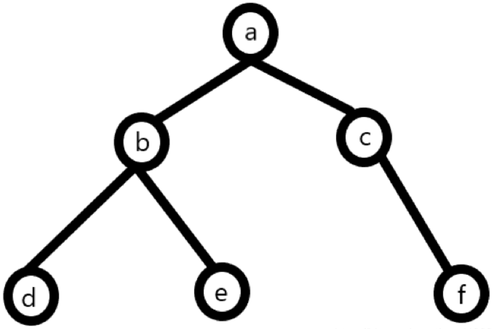
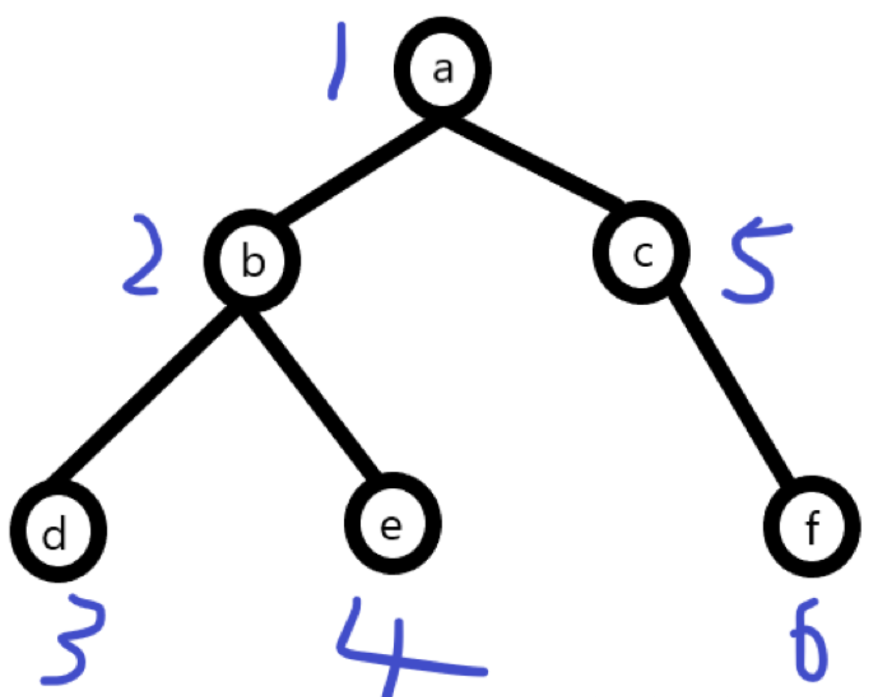
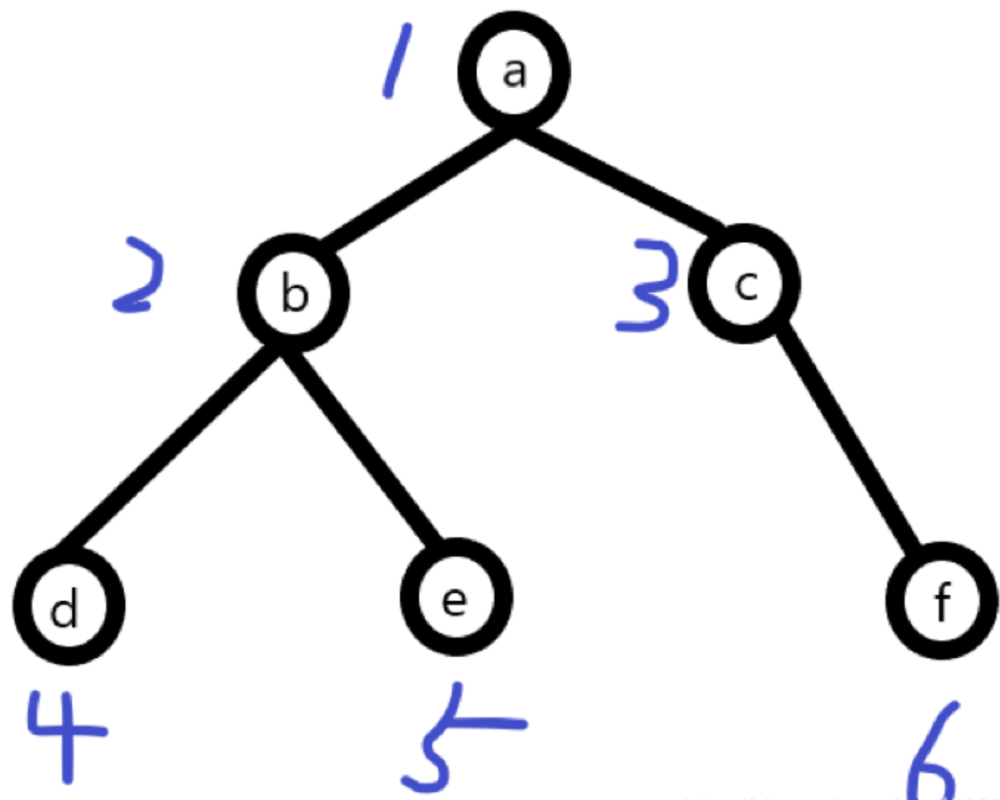

```js
// 先定义一颗简单的树：
let tree = [
    {
        label:'a',
        children:[
            {
                label:'b',
                children:[
                    {
                        label:'d'
                    },
                    {
                        label:'e'
                    }
                ]
            },
            {
                label:'c',
                children:[
                    {
                        label:'f'
                    }
                ]
            }
        ]
    }
]
```

## 树的广度优先遍历
广度优先遍历：从上往下对每一层依次访问，对于上面这颗树的遍历顺序为abcdef（此处算法对应到二叉树上，属于先序遍历）


```js
// 方法一：
let bf=function(tree){
    let queue =tree;
    const res = []
    for(let i=0;i<queue.length;i++){
        console.log(queue[i])
        res.push(queue[i].label)
        if(queue[i].children) {queue=queue.concat(queue[i].children)}
    }
    return res
}
console.time('BFS-start')
const result =bf(tree, []);
console.log(JSON.stringify(result));
console.timeEnd('BFS-start')

// 方法二：
const deepBFS = (root, nodeList = []) => {
  const queue = root;
  // 循环判断队列的长度是否大于0
  while(queue.length > 0) {
      // 取出队列添加的节点
      const p = queue.shift();
      nodeList.push(p.label);
      // 根据节点是否含有children,如果有子节点则添加到队列中
      p.children && p.children.forEach(v => queue.push(v))
  }
  return nodeList;
}
console.time('BFS-start')
const res = deepBFS(tree, []);
console.log(JSON.stringify(res));
console.timeEnd('BFS-start')
```

## 树的深度遍历
深度遍历：对每一个可能的分支路径深入到不能再深入为止，对于上面这颗树的遍历顺序为abdecf

```js
// 方法一：不使用递归
 function dfsHandler(tree, callback) {
     const treeBackup = [...tree];
     const result = []
     
     while(treeBackup.length) {
         const _node = treeBackup.shift();
         result.push(_node.label)
         // 执行遍历回调方法
         typeof callback === 'function' && callback(_node);
         // 存在子节点时将子节点添加到待遍历数据的头部位置
         _node.children && _node.children.length && treeBackup.unshift(..._node.children);
     }

     return result
}

dfsHandler(tree, (val) => {
    console.log('val', val)
})


// 方法二：使用递归
const deepDFS = (root, nodeList = []) => {
  if (root) {
      nodeList.push(root.label);
      // 递归root.children，找root的子节点
      root.children && root.children.forEach(v => deepDFS(v, nodeList))
  }
  return nodeList;
}
const result = deepDFS(root[0], []);
```
