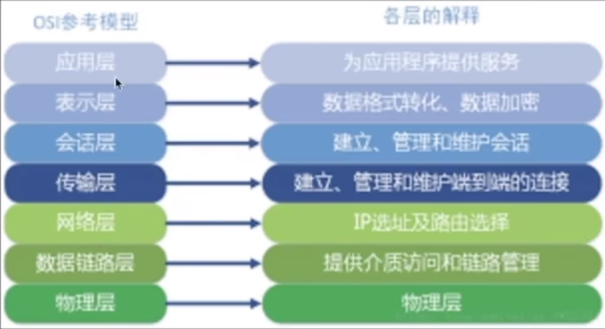

**网络基层模型**

## scoket
Socket是TCP/IP网络的API（位于第四层附近），是为了方便使用TCP或UDP而抽象出来的一层，是位于应用层和传输控制层之间的一组接口

## WebSocket
WebSocket则是一个典型的应用层协议（位于第七层）。WebSocket同HTTP一样也是应用层的协议，但是它是一种双向通信协议，是建立在TCP之上的。一开始的握手需要借助HTTP请求完成。

### WebSocket与Socket的关系
Socket其实并不是一个协议，而是为了方便使用TCP或UDP而抽象出来的一层，是位于应用层和传输控制层之间的一组接口
:::tip
Socket是应用层与TCP/IP协议族通信的中间软件抽象层，它是一组接口。在设计模式中，Socket其实就是一个门面模式，它把复杂的TCP/IP协议族隐藏在Socket接口后面，对用户来说，一组简单的接口就是全部，让Socket去组织数据，以符合指定的协议。
:::

**Socket是传输控制层接口，WebSocket是应用层协议**

### WebSocket目的：
即时通讯、代替轮询

