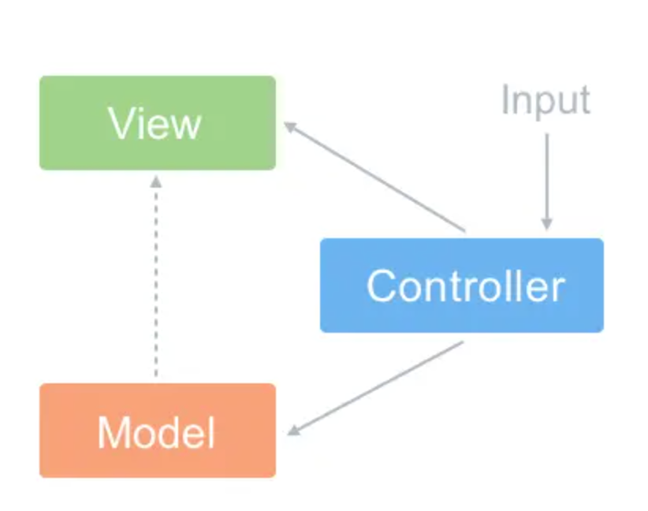
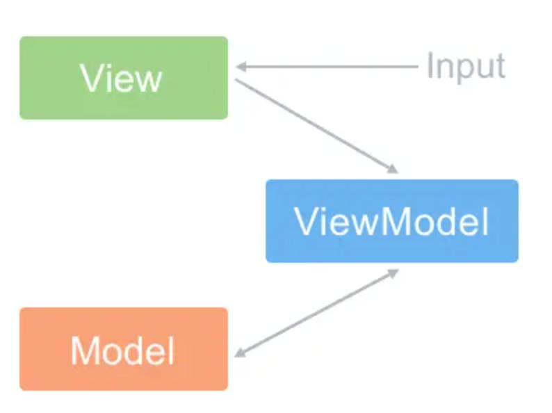

## html、css
### 1.常见的水平垂直居中实现方案
1. flex布局
```css
.father {
  display: flex;
  justify-content: center;
  align-items: center;
}
.son {
  ...
}
```
2. 绝对定位配合margin:auto
```css
.father {
  position: relative;
}
.son {
  position: absolute;
  top: 0;
  left: 0;
  bottom: 0;
  right: 0;
  margin: auto;
}
```
3. 绝对定位配合transform实现
```css
.father {
  position: relative;
}
.son {
  position: absolute;
  top: 50%;
  left: 50%;
  transform: translate(-50%, -50%);
}
```

### 2.BFC问题
BFC：块格式上下文，独立的渲染区域，内部元素不会影响外部的元素

### 3.felx:1; 是哪些属性的缩写，对应的属性代表什么含义
flex: 1;在浏览器中查看分别是flex-grow（设置了对应元素的增长系数）、flex-shrink(指定了对应元素的收缩规则，只有在所有元素的默认宽度之和大于容器宽度时才会触发)、flex-basis（指定了对应元素在主轴上的大小）

### 4.隐藏元素的属性有哪些
- display: none;
- opacity: 0;
- visibility: hidden;

## js
### 1.Js的基础类型，typeof和instanceof的区别
基础类型有：boolean、string、number、bigint、undefined、symbol、null<br />
typeof能识别所有的值类型，识别函数，能区分是否是引用类型。
```js
const a = "str";
console.log("typeof a :>> ", typeof a); // typeof a :>>  string

const b = 999;
console.log("typeof b :>> ", typeof b); // typeof b :>>  number

const c = BigInt(9007199254740991);
console.log("typeof c :>> ", typeof c); // typeof c :>>  bigint

const d = false;
console.log("typeof d :>> ", typeof d); // typeof d :>>  boolean

const e = undefined;
console.log("typeof e :>> ", typeof e); // typeof e :>>  undefined

const f = Symbol("f");
console.log("typeof f :>> ", typeof f); // typeof f :>>  symbol

const g = null;
console.log("typeof g :>> ", typeof g); // typeof g :>>  object

const h = () => {};
console.log("typeof h :>> ", typeof h); // typeof h :>>  function

const i = [];
console.log("typeof i :>> ", typeof i); // typeof i :>>  object
```
instanceof用于检测构造函数的**prototype**属性是否出现在某个实例对象的原型链上
### 2.数组的forEach和map方法有哪些区别？常用哪些方法去对数组进行增、删、改
- forEach是对数组的每一个元素执行一次给定的函数。
- map是创建一个新数组,该新数组由原数组的每个元素都调用一次提供的函数返回的值。
- pop():删除数组后面的最后一个元素,返回值为被删除的那个元素。
- push():将一个元素或多个元素添加到数组末尾，并返回新的长度。
- shift():删除数组中的第一个元素，并返回被删除元素的值。
- unshift():将一个或多个元素添加到数组的开头，并返回该数组的新长度。
- splice():通过删除或替换现有元素或者原地添加新的元素来修改数组，并以数组形式返回被修改的内容。
- reverse(): 反转数组。改变原数组，返回原数组。
```js
const arr = [1, 2, 3, 4, 5, 6];

arr.forEach(x => {
  x = x + 1;
  console.log("x :>> ", x);
});
// x :>>  2
// x :>>  3
// x :>>  4
// x :>>  5
// x :>>  6
// x :>>  7

console.log("arr :>> ", arr); // arr :>>  [ 1, 2, 3, 4, 5, 6 ]

const mapArr = arr.map(x => {
  x = x * 2;
  return x;
});
console.log("mapArr :>> ", mapArr); // mapArr :>>  [ 2, 4, 6, 8, 10, 12 ]
console.log("arr :>> ", arr); // arr :>>  [ 1, 2, 3, 4, 5, 6 ]

const popArr = arr.pop();
console.log("popArr :>> ", popArr); // popArr :>>  6
console.log("arr :>> ", arr); // arr :>>  [ 1, 2, 3, 4, 5 ]

const pushArr = arr.push("a");
console.log("pushArr :>> ", pushArr); // pushArr :>>  6
console.log("arr :>> ", arr); // arr :>>  [ 1, 2, 3, 4, 5, 'a' ]

const shiftArr = arr.shift();
console.log("shiftArr :>> ", shiftArr); // shiftArr :>>  1
console.log("arr :>> ", arr); // arr :>>  [ 2, 3, 4, 5, 'a' ]

const unshiftArr = arr.unshift("b", "c");
console.log("unshiftArr :>> ", unshiftArr); // unshiftArr :>>  7
console.log("arr :>> ", arr); // arr :>>  ['b', 'c', 2,3,4,5,'a']

const spliceArr = arr.splice(2, 4, "d", "e");
console.log("spliceArr :>> ", spliceArr); // spliceArr :>>  [ 2, 3, 4, 5 ]
console.log("arr :>> ", arr); // arr :>>  [ 'b', 'c', 'd', 'e', 'a' ]

const reverseArr = arr.reverse();
console.log("reverseArr :>> ", reverseArr); // reverseArr :>>  [ 'a', 'e', 'd', 'c', 'b' ]
console.log("arr :>> ", arr); // arr :>>  [ 'a', 'e', 'd', 'c', 'b' ]
console.log("reverseArr === arr :>> ", reverseArr === arr); // reverseArr === arr :>>  true
```
### 3.闭包和作用域
闭包是作用域应用的特殊场景。 js中常见的作用域包括全局作用域、函数作用域、块级作用域。<br />
闭包：能够访问另一个函数作用域变量的函数 <br />
闭包形成的原因：内部的函数存在外部作用域的引用就会导致闭包
```js
var a = 0
function foo(){
    var b =14
    function fo(){
        console.log(a, b)
    }
    fo()
}
foo()
// 这里的子函数 fo 内存就存在外部作用域的引用 a, b，所以这就会产生闭包
```
闭包中的变量存储的位置是堆内存（假如闭包中的变量存储在栈内存中，那么栈的回收 会把处于栈顶的变量自动回收。所以闭包中的变量如果处于栈中那么变量被销毁后，闭包中的变量就没有了。所以闭包引用的变量是出于堆内存中的。）<br />
**闭包的作用：**
- 保护函数的私有变量不受外部的干扰。形成不销毁的栈内存。
- 保存，把一些函数内的值保存下来。闭包可以实现方法和属性的私有化
闭包经典使用场景：
1. return 回一个函数
```js
var n = 10
function fn(){
    var n =20
    function f() {
       n++;
       console.log(n)
     }
    return f
}

// 这里的 return f, f()就是一个闭包，存在上级作用域的引用。
var x = fn()
x() // 21
```
2. 函数作为参数
```js
var a = '林一一'
function foo(){
    var a = 'foo'
    function fo(){
        console.log(a)
    }
    return fo
}

function f(p){
    var a = 'f'
    p()
}
f(foo())
/* 输出
*   foo
/ 
// 使用 return fo 返回回来，fo() 就是闭包，f(foo()) 执行的参数就是函数 fo，因为 fo() 中的 a 的上级作用域就是函数foo()，所以输出就是foo
```
使用闭包需要注意什么：容易导致内存泄漏。闭包会携带包含其它的函数作用域，因此会比其他函数占用更多的内存。过度使用闭包会导致内存占用过多，所以要谨慎使用闭包。<br />
经典面试题1：<br />
```js
var data = [];

for (var i = 0; i < 3; i++) {
  data[i] = function () {
    console.log(i);
  };
}

data[0]();
data[1]();
data[2]()
/* 输出
    3
    3
    3
/
// 这里的 i 是全局下的 i，共用一个作用域，当函数被执行的时候这时的 i=3，导致输出的结构都是3。
```

写法1：使用闭包改善上面的写法达到预期效果，写法1：自执行函数和闭包
```js
var data = [];

for (var i = 0; i < 3; i++) {
    (function(j){
      setTimeout( data[j] = function () {
        console.log(j);
      }, 0)
    })(i)
}

data[0]();
data[1]();
data[2]()
```
写法2：使用let
```js
var data = [];

for (let i = 0; i < 3; i++) {
  data[i] = function () {
    console.log(i);
  };
}

data[0]();
data[1]();
data[2]()
// let 具有块级作用域，形成的3个私有作用域都是互不干扰的
```
[js 内存泄漏场景、如何监控以及分析](https://juejin.cn/post/6844904048961781774)

### 4.箭头函数与普通函数的区别
- 在普通函数中，this关键字是在函数调用时动态绑定的。在函数体内部，this指向调用函数的对象。而在箭头函数中，this关键字指向定义函数时的作用域
- 在普通函数中，可以使用 arguments 对象来获取所有传递给函数的参数。但在箭头函数中，arguments 对象不可用，没有自身的prototype


### 5.深拷贝、浅拷贝
基本数据类型赋值传递的是存放在栈内的数据，而引用类型赋值传递的是他们存放在栈内的地址，他们的数据存放在这个地址指向的堆内存里<br />
所以引用类型赋值传递的是存放在栈内的地址，当对新对象数据进行修改时，改变的是这个地址指向的堆内存里的数据<br />
因为新旧对象使用的是相同的地址，地址指向的数据改变后，旧对象的值也就随之改变了。如果不想改变旧对象的值，这时候就用到了深浅拷贝
#### 浅拷贝
浅拷贝创建一个新的对象，只拷贝一层，即拷贝对象里第一层基本数据类型的值和引用类型的地址<br />
如果修改新对象里第一层基本数据类型的值，不会对旧对象产生影响，但如果修改第一层的引用类型的值，仍会对旧对象产生影响（因为虽然新旧对象不再使用同一地址，但第一层的引用类型的地址仍是相同的）
```js
let obj_old = {
    name: 'Tom',
    age: 15,
    favorite: {
        food: 'bread',
        drink: 'milk'
    }
}
// Object.assign()是一种浅拷贝的方法
let obj_new = Object.assign({}, obj_old)
console.log(obj_old === obj_new)  // false
console.log(obj_old.name === obj_new.name)  // true
console.log(obj_old.favorite === obj_new.favorite)  // true
// obj_old === obj_new是false，这说明新旧对象的地址已经不一样了
// obj_old.name === obj_new.name是true，这个是基本数据类型的值是相同的，没有问题
// obj_old.favorite === obj_new.favorite也是true，这里的favorite也是对象，但是他们比较出来的结果不是false而是true，说明这个对象的地址已经是相同的了，它们共享同一块内存空间

// 修改新对象的第一层基本数据类型时，新旧对象互不影响
obj_new.name = 'Jerry'
console.log(obj_old)
console.log(obj_new)

// 修改新对象第一层的引用数据类型时，也就是修改obj_new第一层的favorite对象里的属性值时，obj_old里的favorite相应的属性值也随之改变了，新旧对象相互影响
obj_new.favorite.food = 'cheese'
console.log(obj_old)
console.log(obj_new)
```
#### 浅拷贝的方法
1. Object.assign()
:::tip
语法：Object.assign(target, ...sources)
target 目标对象，接收源对象属性的对象，也是修改后的返回值。 sources 源对象，包含将被合并的属性。
:::
```js
let obj_old = {
    name: 'Tom',
    age: 15,
    favorite: {
        food: 'bread',
        drink: 'milk'
    }
}
let obj_new = Object.assign({}, obj_old)
console.log(obj_old === obj_new)  // false
console.log(obj_old.name === obj_new.name)  // true
console.log(obj_old.favorite === obj_new.favorite)  // true
```
2. 展开运算符 Spread ...
:::tip
语法：{...sources}
sources 源对象，包含将被合并的属性。
:::
```js
let obj_old = {
    name: 'Tom',
    age: 15,
    favorite: {
        food: 'bread',
        drink: 'milk'
    }
}
let obj_new = {...obj_old}
console.log(obj_old === obj_new)  // false
console.log(obj_old.name === obj_new.name)  // true
console.log(obj_old.favorite === obj_new.favorite)  // true
```
3. Array.prototype.concat()
:::tip
语法：arr.concat(value0, /* … ,*/ valueN)
注：如果省略了所有 valueN 参数，则 concat 会返回调用此方法的现存数组的一个浅拷贝。
:::
```js
let arr_old = [1, 2, {name: 'Tom'}]
let arr_new = arr_old.concat()
console.log(arr_old === arr_new)  // false
console.log(arr_old[2] === arr_new[2])  // true
```
4. Array.prototype.slice()
:::tip
语法：arr.slice(begin, end)
注：如果省略了 begin, end 参数，则 slice 会返回调用此方法的现存数组的一个浅拷贝。
:::
```js
let arr_old = [1, 2, {name: 'Tom'}]
let arr_new = arr_old.slice()
console.log(arr_old === arr_new)  // false
console.log(arr_old[2] === arr_new[2])  // true
```
#### 深拷贝
深拷贝就是在堆内存中开辟一个新的空间存放新对象，拷贝原对象的所有属性，拷贝前后的两个对象互不影响。深拷贝的新旧对象不共享内存。<br />
这时我们去修改新对象中的任意层级的任意属性值，都不会对原对象产生影响，原对象依然保持不变
```js
let obj_old = {
  name: 'Tom',
  age: 15,
  hobby: ['eat', 'game'],
  favorite: {
      food: 'bread',
      drink: {
        dname: 'milk',
        color: 'white',
      },
  }
}
let obj_new = _.cloneDeep(obj_old)
console.log(obj_old)
console.log(obj_new)
console.log(obj_old.name === obj_new.name) // true
console.log(obj_old.favorite === obj_new.favorite) // false
console.log(obj_old.favorite.drink === obj_new.favorite.drink) // false
// 这里我们使用了lodash工具库提供的_.cloneDeep深拷贝方法,来看一下新旧对象的对比
// obj_old.name === obj_new.name为true，这个是基本数据类型，完全相同，没有问题
// obj_old.favorite === obj_new.favorite，这里为false，到这里就和浅拷贝不同了，浅拷贝到这一层的时候，对象属性的地址是相同的，而深拷贝是完全拷贝出一个新的对象，所以不管是哪一层，对象属性的地址都是不同的
// obj_old.favorite.drink === obj_new.favorite.drink为false，再往深一层仍然是false，即地址不相同
```
#### 深拷贝的方法
1. 递归实现
使用递归实现原对象每一层的拷贝，当遇到基本数据类型时，直接拷贝，遇到引用数据类型时，递归拷贝它的每个属性
```js
const obj_old = {
  name: 'Tom',
  age: 15,
  hobby: ['eat', 'game'],
  favorite: {
      food: 'bread',
      drink: {
        dname: 'milk',
        color: 'white',
      },
  }
}
const obj_new = {}

function deepClone(newObj, oldObj){
  for (const key in oldObj) {
    if (oldObj[key] instanceof Object) {
      newObj[key] = {}
      deepClone(newObj[key], oldObj[key])
    } else if (oldObj[key] instanceof Array) {
      newObj[key] = []
      deepClone(newObj[key], oldObj[key])
    } else {
      newObj[key] = oldObj[key]
    }
  }
}

deepClone(obj_new, obj_old)

console.log(obj_old)
console.log(obj_new)
console.log(obj_old.name === obj_new.name) // true
console.log(obj_old.favorite === obj_new.favorite) // false
console.log(obj_old.favorite.drink === obj_new.favorite.drink) // false
```
2. lodash工具包
[lodash中文文档](https://www.lodashjs.com/)
引入成功后，我们直接使用lodash提供给我们的函数_.cloneDeep就行
```js
let obj_old = {
  name: 'Tom',
  age: 15,
  hobby: ['eat', 'game'],
  favorite: {
      food: 'bread',
      drink: {
        dname: 'milk',
        color: 'white',
      },
  }
}
let obj_new = _.cloneDeep(obj_old)

console.log(obj_old)
console.log(obj_new)
console.log(obj_old.name === obj_new.name) // true
console.log(obj_old.favorite === obj_new.favorite) // false
console.log(obj_old.favorite.drink === obj_new.favorite.drink) // false
```
3. JSON.parse(JSON.stringify(obj))
- JSON.stringify() 将JSON格式的对象转为字符串
- JSON.parse() 将JSON格式的字符串转为对象
```js
const obj_old = {
  name: 'Tom',
  age: 15,
  hobby: ['eat', 'game'],
  favorite: {
      food: 'bread',
      drink: {
        dname: 'milk',
        color: 'white',
      },
  }
}
const obj_new = JSON.parse(JSON.stringify(obj_old))

console.log(obj_old)
console.log(obj_new)
console.log(obj_old.name === obj_new.name) // true
console.log(obj_old.favorite === obj_new.favorite) // false
console.log(obj_old.favorite.drink === obj_new.favorite.drink) // false
```
虽然这个方法最简单，代码行数最少，但是它也有一定的缺陷：
- 拷贝对象的值中如果有‘函数’，‘undefined’，‘symbol’ JSON.stringify()序列化后，键值对丢失
- 拷贝RegExp会变成空对象{}
- 对象中含有‘NaN’，‘Infinity’会变成null
- 拷贝Date会变成字符串

|  --   | 和原数据是否指向同一对象  | 第一层数据为基本数据类型 | 原数据中包含子对象 |
|  ----  | ----  | ---- | ---- |
| 赋值  | 是 | 改变会使原数据一同改变 | 改变会使原数据一同改变 |
| 浅拷贝  | 否 | 改变**不会**使原数据一同改变 | 改变会使原数据一同改变 |
| 深拷贝	| 否 | 改变**不会**使原数据一同改变 | 改变**不会**使原数据一同改变 |

### 6.事件循环机制
JavaScript事件循环机制是一种用于处理异步任务的机制。<br />
执行流程：主线程从"任务队列"中读取执行事件，这个过程是循环不断的，这个机制被称为事件循环。此机制具体如下:主线程会不断从任务队列中按顺序取任务执行，每执行完一个任务都会检查microtask队列是否为空（执行完一个任务的具体标志是函数执行栈为空），如果不为空则会一次性执行完所有microtask。然后再进入下一个循环去任务队列中取下一个任务执行。**在每次事件循环中，JavaScript 会先执行所有微任务，再执行一个宏任务。**<br />
异步任务的进一步细分---宏任务与微任务：<br />
- 触发宏任务的方式：script 中的代码块、setTimeout()、setInterval()、setImmediate() (非标准，IE 和 Node.js 中支持)、注册事件
- 触发微任务的方式：promise.then()、await、MutationObserver、queueMicrotask()

```js
setTimeout(() => {
  console.log(222)
}, 
2000)  // 2秒后, 同步代码未完成, 于是去排队

setTimeout(() => {
  console.log(111)
}, 
1000)  // 1秒后, 同步代码未完成, 于是去排除

let start = Date.now()
while(Date.now() - start < 3000) {  // 卡3秒 

}
console.log(333)  // 3秒后立即执行
// 333
// 111
// 222
```

```js
// async/await本质上还是基于Promise的一些封装，而Promise是属于微任务的一种
// await相当于promise then 是微任务
setTimeout(function(){   
  console.log('1') 
}); 
new Promise(function(resolve){ 
    console.log('2'); 
    for(var i = 0; i < 10000; i++) {     
      i == 99 && resolve();  
    } })
    .then(function(){   
      console.log('3') 
    });  
console.log('4');
// 2
// 4
// 3
// 1
// new Promise是一个构造函数，是同步任务，先同步原则,先输出2 ，4 同步任务执行完后,setTimeout的回调再宏任务队列，promise的then方法再微任务队列，秉承先微再宏原则，再输出3 1
```

```js
// 要注意的是如果await的是promise对象，await会暂停async函数内后面的代码，先执行async函数外的同步代码（注意，promise内的同步代码会先执行），等着 Promise 对象 fulfilled，然后把 resolve 的参数作为 await 表达式的运算结果返回后，再继续执行async函数内后面的代码。
async function async1() {
  console.log('async1 start')
  await async2();
  console.log('async1 end')
}

async function async2() {
  console.log('async2')
}

console.log('script start')

setTimeout(function () {
  console.log('setTimeout')
}, 0)

async1();

new Promise(
  function (resolve) {
    console.log('promise1')
    resolve()
  })
  .then(
  function () {
      console.log('promise2')
  })
console.log('script end')
// script start
// async1 start
// async2
// promise1
// script end
// async1 end
// promise2
// setTimeout
// 解析：先同步任务：script start、async1 start。setTimeout加入到宏任务队列。await相当于promise then是微任务，执行async输出async2。这里注意：await的是promise对象，所以先不执行async1函数内的其他内容，要完成其他所有的同步任务，那就接着输出：promise1、script end。在执行async1函数的其他内容，输出async1 end。紧接着执行promise的then方法输出promise2最后执行setTimeout
```

```js
Promise.resolve().then(()=>{
  console.log('第一个回调函数：微任务1')  
  setTimeout(()=>{
    console.log('第三个回调函数：宏任务2')
  },0)
});
setTimeout(()=>{
  console.log('第二个回调函数：宏任务1')
  Promise.resolve().then(()=>{
    console.log('第四个回调函数：微任务2')   
  })
},0)
// 第一个回调函数：微任务1
// 第二个回调函数：宏任务1
// 第四个回调函数：微任务2
// 第三个回调函数：宏任务2
// 解析：这一堆js代码会作为宏任务执行，Promise作为p1压入微任务队列，setTimeout作为s1压入宏任务队列，此时代码都执行完毕。执行宏任务队列之前会清空微任务队列，执行p1：打印"第一个回调函数：微任务1"，然后把setTimeout作为s2压入宏任务队列。然后接着执行宏任务s1：打印"第二个回调函数：宏任务1"，然后把Promise作为p2压入微任务队列。此时一个循环结束，执行下一个宏任务，先把微任务队列清空，打印："第四个回调函数：微任务2"。接着执行宏任务队列，打印："第三个回调函数：宏任务2"。
// 事件循环的标志是宏任务队列结束
```


### 7.从输入一个URL地址到浏览器完成渲染的整个过程
1. 浏览器地址栏输入URL并回车
2. 浏览器查找当前URL是否存在缓存，并比较缓存是否过期
3. DNS解析URL对应的IP
4. 根据IP建立TCP连接（三次握手）
5. 发送http请求
6. 服务器处理请求，浏览器接受HTTP响应
7. 浏览器解析并渲染页面
8. 关闭TCP连接（四次握手）
详情可参考：[从输入URL到看到页面发生了什么？](https://juejin.cn/post/6844903832435032072)
## vue
### 1. MVC和MVVM区别
1. MVC全名是Model View Controller，是模型（model）-视图（view）-控制器（controller）的缩写，一种软件设计典范<br />
Model（模型）：是应用程序中用于处理应用程序数据逻辑的部分。通常模型对象负责在数据库中存取数据<br />
View（视图）：是应用程序中处理数据显示的部分。通常视图是依据模型数据创建的<br />
Controller（控制器）：是应用程序中处理用户交互的部分。通常控制器负责从视图读取数据，控制用户输入，并向模型发送数据<br />

MVC思想：controller负责将model的数据用view显示出来。换句话说，就是在controller里面把model的数据赋值给view
2. MVVM
MVVM新增了VM类<br />

ViewModel 层：做了两件事达到了数据的双向绑定 一是将【模型】转化成【视图】，即将后端传递的数据转化成所看到的页面。实现的方式是：数据绑定。二是将【视图】转化成【模型】，即将所看到的页面转化成后端的数据。实现的方式是：DOM 事件监听。<br />
MVVM 与 MVC 最大的区别就是：它实现了 View 和 Model 的自动同步，也就是当 Model 的属性改变时，我们不用再自己手动操作 Dom 元素，来改变 View 的显示，而是改变属性后该属性对应 View 层显示会自动改变（对应Vue数据驱动的思想）<br />
整体看来，MVVM 比 MVC 精简很多，不仅简化了业务与界面的依赖，还解决了数据频繁更新的问题，不用再用选择器操作 DOM 元素。因为在 MVVM 中，View 不知道 Model 的存在，Model 和 ViewModel 也观察不到 View，这种低耦合模式提高代码的可重用性
:::tip
注意：vue并没有完全遵循MVVM的思想，这一点官网自己也有说明
严格的 MVVM 要求 View 不能和 Model 直接通信，而 Vue 提供了$refs 这个属性，让 Model 可以直接操作 View，违反了这一规定，所以说 Vue 没有完全遵循 MVVM。
:::

### 2.为什么data是一个函数
在vue2.x中组件中的data是一个对象或者是返回对象的函数，用于定义组件的初始数据。<br />
在vue3.x中组件中的data必须是一个返回对象的函数。
这个是出于性能和响应式系统的考虑。在vue2.x中，组件的data对象是被复制的，这样就会出现多个组件实例共享同一个data对象的情况，当其中一个组件实例的data发生改变时，其他共享同一data对象的组件实例的data也会随之改变，这样就导致了数据不可预测的情况。而在vue3.x中，每个组件实例都会拥有一个独立的data对象，这样就避免了数据不可预测的情况。
:::tip
在Vue2.x中，组件的data对象是被复制的。当一个组件实例被创建时，Vue会将该组件的data对象复制一份，然后将复制后的对象作为该组件实例的数据对象（即该组件实例的 $data 属性）。这样，不同组件的data对象就可以互相独立地操作，而不会相互影响。
:::
### 3.computed和watch有什么区别
- computed是根据依赖的数据自动计算并返回一个值。computed是具有缓存功能的，只有依赖的数据发生变化时才会重新计算值，可以设置getter、setter
- watch则是手动定义需要监听的数据，当这些数据发生变化时，执行特定的操作。而watch没有缓存功能，每次数据变化都会执行特定的操作 <br />
**使用场景：**
1. computed一般适用于模板渲染时，莫个值是依赖于其他响应式对象甚至是计算型计算而来。
2. 监听器适用于监听某个值变化去完成一段复杂的数据逻辑

### 4.vue中的路由有哪些方式
有两种方式：hash模式和history模式
- hash模式基于URL的hash值来实现路由，URL中的#符号用于分隔路由路径和查询参数，不会触发浏览器的刷新，适用于单页应用。
- history模式使用HTML5的history API实现路由，可以通过pushState和replaceState方法修改URL，可以支持前进和后退，需要服务器配置支持

### 5.vue2.0响应式数据的原理
整体思路是数据劫持 + 观察者模式<br />
对象内部通过defineReactive方法，使用Object.defineProperty将属性进行劫持（只会劫持已存在的属性），数组则是通过重写数组方法来实现。当页面使用对应属性时，每个属性都有自己的dep属性，存放他所依赖的watcher（依赖收集），当属性变化时会通知自己对应的watcher去更新（派发更新）
```js
class Observer {
  // 观测值
  constructor(value) {
    this.walk(value);
  }
  walk(data) {
    // 对象上的所有属性依次进行观测
    let keys = Object.keys(data);
    for (let i = 0; i < keys.length; i++) {
      let key = keys[i];
      let value = data[key];
      defineReactive(data, key, value);
    }
  }
}
// Object.defineProperty数据劫持核心 兼容性在ie9以及以上
function defineReactive(data, key, value) {
  observe(value); // 递归关键
  // --如果value还是一个对象会继续走一遍odefineReactive 层层遍历一直到value不是对象才停止
  //   思考？如果Vue数据嵌套层级过深 >>性能会受影响
  Object.defineProperty(data, key, {
    get() {
      console.log("获取值");

      //需要做依赖收集过程 这里代码没写出来
      return value;
    },
    set(newValue) {
      if (newValue === value) return;
      console.log("设置值");
      //需要做派发更新过程 这里代码没写出来
      value = newValue;
    },
  });
}
export function observe(value) {
  // 如果传过来的是对象或者数组 进行属性劫持
  if (
    Object.prototype.toString.call(value) === "[object Object]" ||
    Array.isArray(value)
  ) {
    return new Observer(value);
  }
}
```

### 6.vue2如何监听数组变化
不是因为Object.defineProperty检测不到数组变化，因为对于数组的每次变化都可能影响它索引key的变动，从而重新遍历，添加劫持，数据量大时非常影响性能。<br />
数组考虑性能原因没有用 defineProperty 对数组的每一项进行拦截，而是选择对 7 种数组（push,shift,pop,splice,unshift,sort,reverse）方法进行重写(AOP 切片思想)<br />
所以在vue2中修改数组的索引、长度是无法检测到的。需要通过以上7种变异方法修改数组才会触发数组对应的watcher进行更新
```js
// src/obserber/array.js
// 先保留数组原型
const arrayProto = Array.prototype;
// 然后将arrayMethods继承自数组原型
// 这里是面向切片编程思想（AOP）--不破坏封装的前提下，动态的扩展功能
export const arrayMethods = Object.create(arrayProto);
let methodsToPatch = [
  "push",
  "pop",
  "shift",
  "unshift",
  "splice",
  "reverse",
  "sort",
];
methodsToPatch.forEach((method) => {
  arrayMethods[method] = function (...args) {
    //   这里保留原型方法的执行结果
    const result = arrayProto[method].apply(this, args);
    // 这句话是关键
    // this代表的就是数据本身 比如数据是{a:[1,2,3]} 那么我们使用a.push(4)  this就是a  ob就是a.__ob__ 这个属性就是上段代码增加的 代表的是该数据已经被响应式观察过了指向Observer实例
    const ob = this.__ob__;

    // 这里的标志就是代表数组有新增操作
    let inserted;
    switch (method) {
      case "push":
      case "unshift":
        inserted = args;
        break;
      case "splice":
        inserted = args.slice(2);
      default:
        break;
    }
    // 如果有新增的元素 inserted是一个数组 调用Observer实例的observeArray对数组每一项进行观测
    if (inserted) ob.observeArray(inserted);
    // 之后咱们还可以在这里检测到数组改变了之后从而触发视图更新的操作--后续源码会揭晓
    return result;
  };
});
```
### 7.vue2.0和3.0响应式原理的区别
vue3.x使用proxy代替Object.defineProperty。因为可以直接检测对象、数组的变化，并且有多达13中拦截方法
```js
import { mutableHandlers } from "./baseHandlers"; // 代理相关逻辑
import { isObject } from "./util"; // 工具方法

export function reactive(target) {
  // 根据不同参数创建不同响应式对象
  return createReactiveObject(target, mutableHandlers);
}
function createReactiveObject(target, baseHandler) {
  if (!isObject(target)) {
    return target;
  }
  const observed = new Proxy(target, baseHandler);
  return observed;
}

const get = createGetter();
const set = createSetter();

function createGetter() {
  return function get(target, key, receiver) {
    // 对获取的值进行放射
    const res = Reflect.get(target, key, receiver);
    console.log("属性获取", key);
    if (isObject(res)) {
      // 如果获取的值是对象类型，则返回当前对象的代理对象
      return reactive(res);
    }
    return res;
  };
}
function createSetter() {
  return function set(target, key, value, receiver) {
    const oldValue = target[key];
    const hadKey = hasOwn(target, key);
    const result = Reflect.set(target, key, value, receiver);
    if (!hadKey) {
      console.log("属性新增", key, value);
    } else if (hasChanged(value, oldValue)) {
      console.log("属性值被修改", key, value);
    }
    return result;
  };
}
export const mutableHandlers = {
  get, // 当获取属性时调用此方法
  set, // 当修改属性时调用此方法
};
```

### 8.vue父子组件生命周期钩子函数执行顺序
- 加载渲染过程
父组件beforeCreate-父组件created-父组件beforeMounted-子组件beforeCreate-子组件created-子组件beforeMounted-子组件mounted-父组件mounted
- 子组件更新过程
父组件beforeUpdate-子组件beforeUpdate-子组件updated-父组件updated
- 父组件更新过程
父组件beforeUpdate-父组件updated
- 销毁过程
父组件beforeDestroy-子组件beforeDestroy-子组件destroyed-父组件destroyed

### 9.虚拟DOM是什么？有什么优缺点？
vue2的VirtualDOM借鉴了开源库snabbdom的实现。虚拟DOM本质上就是一个原生的js对象用来去描述一个真实的DOM节点（描述了真实DOM树的属性和结构），是对真实DOM的一层抽象。可以提高vue应用的性能和可维护性。<br />
当数据发生变化时，vue会重新渲染虚拟DOM，与之前的虚拟DOM进行比较，并找出变化的部分，只将这部分更新到真实DOM上，从而避免了无效的dom操作。<br />
虚拟DOM的优点：
- 提供性能：通过虚拟DOM，避免了大量的DOM操作，减少了页面渲染的开销，从而提高了应用的性能
- 提供可维护性：由于虚拟DOM是轻量级的js对象，可以方便的进行组建的复用和维护，从而提高了应用的可维护性
- 无需手动操作DOM：不需要在手动操作DOM，只要写好View-Model的代码逻辑，框架会根据虚拟DOM和数据双向绑定，帮我们以可预期的方式更新视图，帮我们极大地提高了开发效率
- 实现跨平台：由于虚拟DOM是独立于平台的，可以在不同的平台上使用，例如web端、移动端<br />
虚拟DOM的缺点：
- 首次渲染开销较大：首次渲染大量 DOM 时，由于多了一层虚拟 DOM 的计算，会比 innerHTML 插入慢。
- 内存占用较大：由于需要维护虚拟DOM，因此会占用一定的内存空间，如果虚拟DOM层次较深，会导致内存占用较大。

### 10.使用过 Vue SSR 吗？说说 SSR
- 在服务器端使用Vue SSR插件，将Vue组件渲染成HTML字符串。
- 在服务器端使用Node.js等后端框架，将HTML字符串返回给客户端。
- 在客户端使用Vue客户端插件，将服务器端渲染的HTML字符串与客户端生成的JavaScript代码进行激活，生成完整的Vue组件。<br />
**主要解决两个问题：** <br />
1. 更好的SEO
- SPA页面的内容是ajax获取，而搜索引擎爬取工具并不会等待Ajax异步完成后再进行爬取页面内容，所以在SPA页面是抓取不到页面通过Ajax获取到的内容，爬虫获取的html，是一个没有数据的空壳子。
- 而SSR，是服务端直接将数据处理好，再拼接组装好，返回一个已经渲染好的页面（数据已经包含在页面中），所以爬虫可以爬取渲染好的页面。
2. 首屏渲染更快
- SPA页面，需要等所有的Vue编译后的js文件全部下载完成之后，才开始进行页面的渲染，文件下载需要一定的时间，所以首屏渲染需要一定的时间。
- SSR直接有服务端渲染好页面直接返回显示，不需要等待下载js文件后再去渲染，所以SSR能解决SPA页面首屏渲染时间太长的问题。<br />
**优点：**
- 提高SEO：由于SSR可以在服务器端生成HTML，搜索引擎可以直接爬取到完整的HTML，提高了SEO优化效果。
- 提高性能：由于SSR可以在服务器端生成HTML，可以减少客户端渲染的时间，提高了页面的加载速度。
- 提高可维护性：由于SSR可以将Vue组件在服务器端进行渲染，可以使得前后端工程师共同维护组件，提高了项目的可维护性。<br />
**缺点：**
- 开发条件会受到限制，服务端只支持beforeCreate、created两个钩子函数，当我们需要一些外部扩展库时需要特殊处理，服务端渲染应用程序也需要处于 Node.js 的运行环境。<br />
总结：
- 并不是所有网站都需要SEO，比如企业内部管理网站等，不惜要SEO，所以不需要使用SSR，直接使用SPA更好。
- 有些项目首屏，可以借用路由懒加载、预加载来解决

### 11.SPA（单页应用）
SPA是指在Web应用程序中使用单个HTML页面作为应用程序的容器，动态地更新该页面的部分内容，不需要重新加载整个页面，以提供更流畅、更快速的用户体验。SPA通常使用Ajax或WebSocket技术来异步加载数据，不需要刷新整个页面。Vue.js可以很好地支持SPA模式，它使用Vue Router管理不同页面之间的切换，并使用Vue.js的组件化开发模式来构建整个应用程序。

### 12.nextTick使用场景和原理
nextTick是用于下一次DOM更新循环结束之后执行延迟回调的函数。<br />
主要思路就是采用微任务优先的方式调用异步方法去执行 nextTick 包装的方法 <br />
**使用场景：**
1. 获取元素的尺寸
在组件的 mounted 钩子函数中获取某个元素的宽度或高度通常是不准确的，因为此时元素可能还没有被渲染。此时可以使用 nextTick等待组件更新后再获取元素的尺寸。
2. 在更新后执行某些动画效果
在更新数据后，需要等待Vue实例更新后才能执行某些动画效果。此时可以使用nextTick来延迟执行动画效果，确保动画效果能够正确地应用到更新后的DOM上。

## vue-router
### 1.vue-router中常用的路由模式实现原理
1. hash模式<br />
URL的路径会添加一个#符号，例如：http://example.com/#/user/profile。vue-router利用浏览器的hashchange事件来监控URL的变化，从而更新路由状态
2. history模式<br />
vue-router利用HTML5 History API中的pushState和replaceState方法来操作浏览器历史记录，并通过popstate事件来处理路由状态的更新。<br />
总的来说，vue-router利用浏览器、HTML5 History提供的API来实现路由状态的监听和管理，在用户操作浏览器时，动态更新页面内容，从而实现单页应用程序的效果


